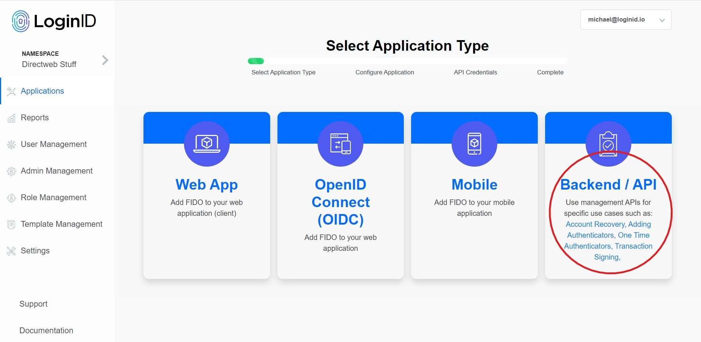
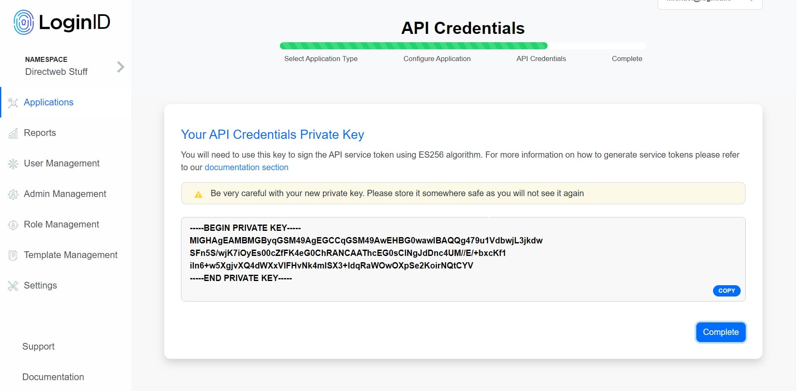

# loginid-cognito-lambda

An integration of Loginid and AWS Cognito authentication with custom authentication Lambdas.

## Requirements

- Python (Backend)
- NodeJS (Frontend)
- Cognito User Pool
- Loginid Admin Account

## Features

- Register Password
- Register FIDO2
- Login Password
- Login FIDO2
- Add Mulitple FIDO2 Credentials
- Add FIDO2 to Exisiting Password User

## LoginID Set-Up

Your going to need a confidential backend client.

1. Head over to https://playground.loginid.io and login into your account.
2. Click on `Add Application` and create a `Backend` client.



3. Fill out the name of the application (could be anything) and the website URL. This is where your application is currently hosted. If working in development under `localhost`, then entering `http://localhost` is a valid value. You would have to create a seperate client for every different host domain. Click `Create`.


4. Once your client is created take note of the `Client ID`. Click `Next Step`.
5. You are going to attach an API credential to this client now with one of the options currently provided. If you have an existing API credential you can attach that as well. In this example, I will click `Generate key pair for me` and let LoginID to create an `ES256` keypair, attach the API credential, and send the private key to me. Store this private key as it will be used to sign service tokens (Bearer authorization tokens) and will be needed to make management API calls.



6. Go to `Settings` on the left hand side and take note of the `Base API URL`.


From here you should have the following needed values:

- Directweb Base URL
- Backend Client ID
- ES256 Private Key

## Cognito Set-Up

The `./aws/Template.yaml` file contains descriptions of the necessary AWS services. You can use it as a reference to manually set up the services. Alternatively, you can utilize the `Template.yaml` file with [CloudFormation](https://aws.amazon.com/cloudformation/resources/templates/), which will create the majority of the required service configurations automatically. If you opt to use `CloudFormation`, it may be advisable to exclude the `Layers` property until you are able to upload your own layer for the LoginID SDK dependencies.

We will further elaborate on certain crucial aspects of the setup process below.

### Cognito User Pool

- Make sure that email validation is enabled.
- Configured lambda triggers will need to be created and enabled later on for `DefineAuthChallenge`, `CreateAuthChallenge`, and `VerifyAuthChallengeResponse`.

### Cognito User Pool Client

A client will need to be created.

- Make sure that the following Properties are readable and writeable: `email` and `name`.

### Authentication Lambdas

It's worth noting that much of this demo is based on the approach outlined in this [AWS blog post](https://aws.amazon.com/blogs/security/how-to-implement-password-less-authentication-with-amazon-cognito-and-webauthn/). Although this demo is similar to the post, it leverages LoginID's API to handle the FIDO2 credential storage and verification process. You can refer to the blog post and this [documentation](https://docs.aws.amazon.com/cognito/latest/developerguide/amazon-cognito-user-pools-authentication-flow.html#amazon-cognito-user-pools-custom-authentication-flow) to gain a better understanding of how the custom authentication Lambdas operate.

For the Lambdas in this demo, I opted to use Python. Please be aware that the `CreateAuthChallenge` and `VerifyAuthChallenge` Lambdas require a `Layer` that includes the LoginID SDK as a dependency. If you choose to use the provided Lambda code in `./aws/`, ensure that the `Layer` is generated in a Linux environment. This is critical because one of the LoginID SDK dependencies relies on the underlying platform. If there is a mismatch, the Lambdas will not function correctly and will throw an error.

It is also important to note that the CreateAuthChallenge and VerifyAuthChallenge also require environment variables. These are:

- LOGINID_BASE_URL
- LOGINID_CLIENT_ID
- PRIVATE_KEY

Obtaining these variables are explained [above](#loginid-set-up).

### IAM Privileges

This demo uses a combination of `amazon-cognito-identity-js` and a backend client (`boto-3`) to leverage the cognito APIs.

## Environment Variables

This demo supports .env files. The following variables are required:

```
LOGINID_BASE_URL=                       # Base URL obtained from LoginID dashboard
LOGINID_CLIENT_ID=                      # Backend client ID obtained from LoginID dashboard
PRIVATE_KEY=                            # ES256 private key obtained from LoginID dashboard
COGNITO_USER_POOL_ID=                   # Cognito user pool ID
COGNITO_CLIENT_ID=                      # Cognito OAuth2 client
COGNITO_REGION_NAME=                    # Cognito region name
COGNITO_BASE_URL=                       # Cognito's base URL of the given region
```

## How to Run

### Backend

Open up a terminal and enter root of project. This setup will use a virtual environment. You can use whatever suites you.

```
python -m venv venv
source ./venv/.bin/activate
pip install requirements.txt
flask run
```

### Frontend

Open up a terminal and enter root of project.

```
npm install
npm run dev
```
